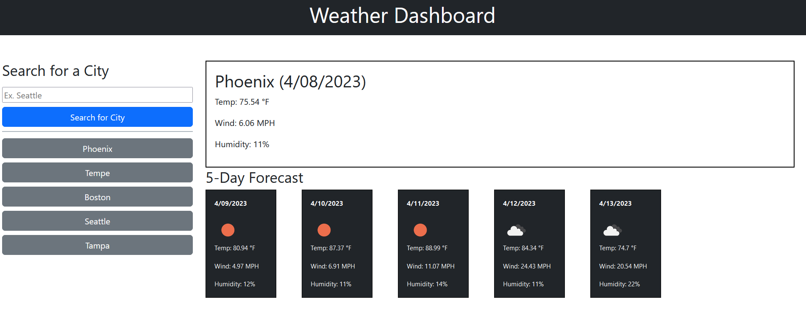

# Weather Dashboard

## Description
Allows you to search for a city and returns the current weather as well as 5-day forecast for said city

You can access the page [here](https://davidpeguero.github.io/Weather-Dashboard/)

## Screnshots

#### Main Page (After Search)

## Usage
Write a city name into the search input box and click the button below and it will return the weather information.

Alternatively you can click on any of the previous searches belowe indicated by the grey buttons under the primary search bar.

## Installation 
N/A

## License
MIT License